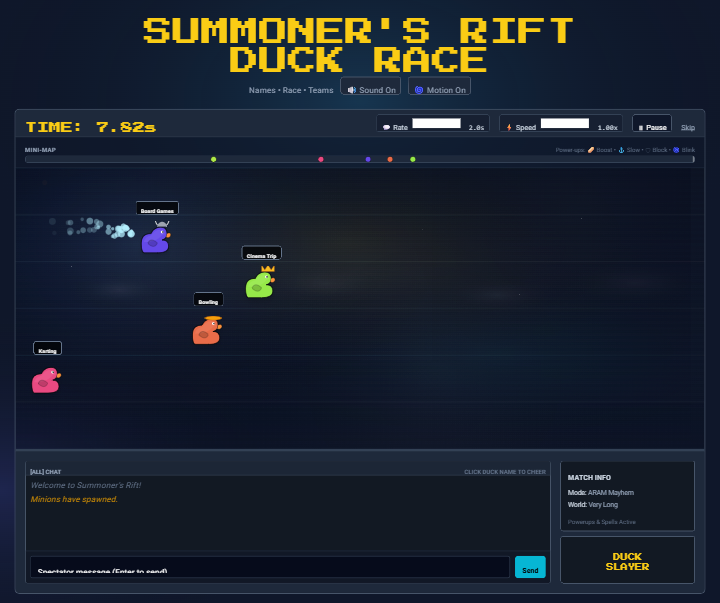

# Duck Race Decider

A single-page, League of Legends-themed duck race that turns "what do we do tonight" into a race instead of a coin flip — built for a friend group (implicitly gamers/LoL players) who want a random decision to feel like an event, not a shrug.

**Live demo:** https://hazzjc.github.io/DuckRaceDecider/

## What it does

1. Type your options (one per line) into the "Summoner Names" box — anything works: restaurants, movies, who does the dishes, weekend plans. Each option becomes a duck.
2. Pick a race duration (5–30s) and a race mode:
   - **Blind Pick** — pure racing plus a "catch-up" rubberband so a duck that falls too far behind late in the race gets a speed boost, keeping the finish close.
   - **Ranked** — no rubberbanding, no items, just each duck's randomly-rolled base speed.
   - **ARAM Mayhem** — everything on: random powerups (bread = speed boost, anchor = slow, shield = block, portal = blink forward) spawn on the track, and ducks randomly cast League-style "spells" (Ice/Freeze, Ignite) at each other mid-race.
3. Hit **Start Race**. Each duck is given a randomly-rolled "skill" multiplier at the start, so the race isn't a flat coin-flip — it's biased randomness animated as an actual race, with a live "chat" panel firing off trash-talk lines styled like League of Legends in-game/post-game chat ("Quack diff. Check the replay.", "ff 15", "duck gap", etc.) reacting to who's winning or losing.
4. Whichever duck crosses the finish line first wins. The results screen shows a podium plus splits everyone into "Blue Side" / "Red Side" teams (alternating or top/bottom split, with a swap-sides option and a one-click "Copy Teams" button) — useful if the decision is actually "which team are we on."

## Why a duck race, and why the LoL chat theme

The page title and UI ("Summoner's Rift Duck Race", lane-based track, minions, wards-style minimap, powerups named after summoner spells, "Blue Side" / "Red Side" team split) make the intent pretty explicit: this reskins a classic "duck race" random-picker as a mock League of Legends match. The chat panel's trash talk, callouts ("ff 15", "inting", "jgl???"), and match info HUD only make sense if the target audience already speaks LoL chat — so this is a decider tool for a group that already plays or watches League, using shared in-jokes to make a random pick funnier than a plain spinner.

## Architecture

This is intentionally a single self-contained static file: **`index.html`** (~70KB), no build step, no backend, no dependencies beyond two CDN includes (Tailwind's play-CDN for styling, a Google Font for the pixel typeface). Everything — the race simulation, the canvas-based particle/splash effects, the Web Audio API sound effects, the chat line generator, and team-splitting logic — is inline `<script>` in that one file. There is no framework, no bundler, and no server component; it's deployed as-is via GitHub Pages.

## Quality / testing

There are no automated tests, CI, or linting configured in this repo. Verification is manual: open the page and run a race. The screenshot above was captured by actually running the live GitHub Pages deployment.

## Setup

No install required.

- **Easiest:** open the live demo — https://hazzjc.github.io/DuckRaceDecider/
- **Locally:** clone the repo and open `index.html` directly in a browser (or serve the folder with any static file server). No `npm install`, no build step.

## Limitations and status

- No automated tests or CI.
- No license file — see below.
- All state (best-time record) is stored in the browser's `localStorage`; nothing is shared or synced between devices or players.
- Requires a browser with Web Audio API support for sound; the UI includes a mute toggle and a reduced-motion toggle for accessibility.
- The "randomness" is a live-animated race rather than an instant pick — by design, but it means the result takes as long as the configured race duration (5–30s) to reveal.
- This is a small hobby/fun project, not a maintained product — expect it to be feature-complete as-is rather than under active development.

## License / attribution

This repository does not currently include a license file. All rights are reserved by default under standard copyright — if you want to reuse or fork this code, check with the repo owner first.
